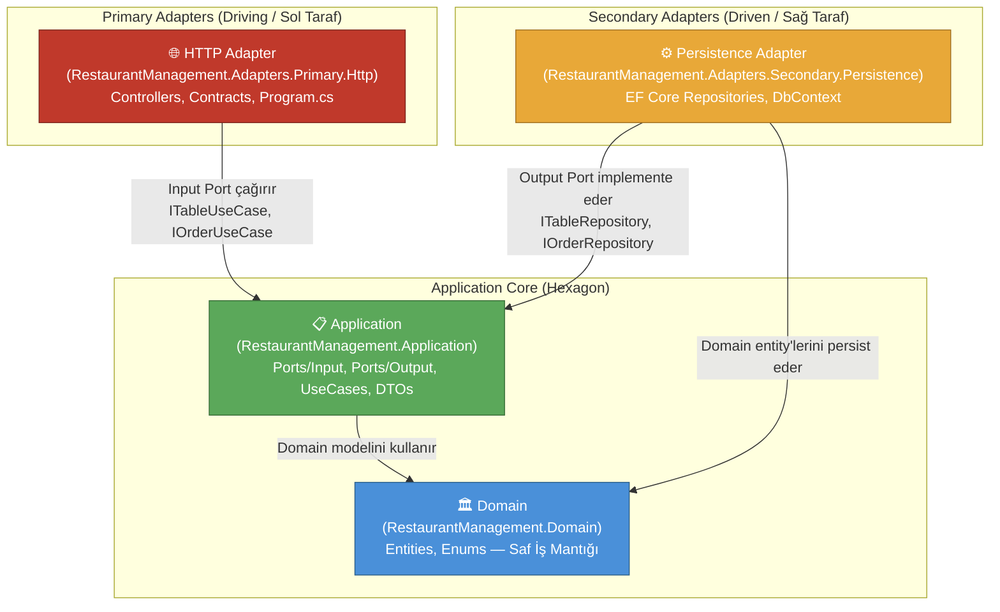

# Restoran Sipariş ve Mutfak Yönetim Sistemi - Hexagonal Architecture

Bu proje, Hexagonal Architecture (Ports & Adapters) kullanılarak geliştirilmiş bir restoran sipariş ve
mutfak yönetim sistemidir. .NET 10 ile oluşturulmuştur.

## 🎯 Proje Hakkında

Hexagonal Architecture (a.k.a. Ports & Adapters), Alistair Cockburn tarafından 2005 yılında
tanımlanmıştır. Temel fikir, uygulamanın çekirdeğini (domain + use cases) dış dünyadan izole etmektir.
Uygulama çekirdeği, **port** adı verilen arayüzler aracılığıyla dışarıyla iletişim kurar;
bu portların gerçek dünya implementasyonları ise **adapter** adını alır.

### Temel Kavramlar

| Kavram | Açıklama | Bu Projede |
|--------|----------|------------|
| **Input Port** (Driving Port) | Use case arayüzleri; uygulamayı "neyin kullandığını" tanımlar | `Application/Ports/Input/I*UseCase.cs` |
| **Output Port** (Driven Port) | Repository arayüzleri; uygulamanın "neye ihtiyaç duyduğunu" tanımlar | `Application/Ports/Output/I*Repository.cs` |
| **Primary Adapter** (Driving) | Input portları çağıran dış bileşenler | `Adapters.Primary.Http` (REST Controllers) |
| **Secondary Adapter** (Driven) | Output portları implemente eden dış bileşenler | `Adapters.Secondary.Persistence` (EF Core) |

### Bağımlılık Diyagramı



## 🏗️ Proje Yapısı

```
src/
├── RestaurantManagement.Domain/                        # Saf Domain Modeli
│   ├── Common/
│   │   └── BaseEntity.cs
│   └── Entities/
│       ├── MenuItem.cs
│       ├── Order.cs
│       ├── OrderItem.cs
│       ├── OrderStatus.cs
│       ├── Table.cs
│       └── TableStatus.cs
│
├── RestaurantManagement.Application/                   # Application Core (Hexagon İçi)
│   ├── Common/
│   │   ├── DTOs/                                       # Veri Transfer Nesneleri
│   │   └── Result.cs                                   # Result Pattern
│   ├── Ports/
│   │   ├── Input/                                      # 🔵 Driving Ports (Use Case arayüzleri)
│   │   │   ├── IMenuItemUseCase.cs
│   │   │   ├── IOrderUseCase.cs
│   │   │   └── ITableUseCase.cs
│   │   └── Output/                                     # 🟠 Driven Ports (Repository arayüzleri)
│   │       ├── IMenuItemRepository.cs
│   │       ├── IOrderRepository.cs
│   │       ├── ITableRepository.cs
│   │       └── IUnitOfWork.cs
│   └── UseCases/                                       # Input Port implementasyonları
│       ├── MenuItems/
│       │   └── MenuItemUseCase.cs
│       ├── Orders/
│       │   ├── CreateOrderRequest.cs
│       │   ├── CreateOrderValidator.cs
│       │   └── OrderUseCase.cs
│       └── Tables/
│           └── TableUseCase.cs
│
├── RestaurantManagement.Adapters.Primary.Http/         # 🔴 Primary Adapter (Driving/Sol Taraf)
│   ├── Common/
│   │   └── ResultHelper.cs
│   ├── Contracts/
│   │   ├── Orders/
│   │   │   ├── CreateOrderRequest.cs
│   │   │   ├── OrderItemRequest.cs
│   │   │   └── UpdateOrderStatusRequest.cs
│   │   └── Tables/
│   │       └── UpdateTableStatusRequest.cs
│   ├── Controllers/
│   │   ├── MenuItemsController.cs
│   │   ├── OrdersController.cs
│   │   └── TablesController.cs
│   └── Program.cs
│
└── RestaurantManagement.Adapters.Secondary.Persistence/ # 🟡 Secondary Adapter (Driven/Sağ Taraf)
    ├── Data/
    │   └── RestaurantDbContext.cs
    └── Repositories/
        ├── MenuItemRepository.cs
        ├── OrderRepository.cs
        ├── TableRepository.cs
        └── UnitOfWork.cs
```

## 🚀 Teknolojiler

- **.NET 10** — Modern web API framework
- **ASP.NET Core** — Web API
- **Entity Framework Core** — ORM (In-Memory Database)
- **FluentValidation** — Input validation (use case içinde explicit çağrı)
- **Scalar/OpenAPI** — API dokümantasyonu

## 📦 Kurulum ve Çalıştırma

```bash
# Projeyi klonlayın
git clone <repository-url>
cd ArchitecturePatterns/Examples/Hexagonal

# Bağımlılıkları yükleyin
dotnet restore

# Projeyi çalıştırın
cd src/RestaurantManagement.Adapters.Primary.Http
dotnet run

# Scalar UI
http://localhost:5000/scalar
```

## 🔍 API Endpoints

### Masa Yönetimi (Tables)

| Method | Endpoint | Açıklama |
|--------|----------|----------|
| `GET` | `/api/tables` | Tüm masaları listele |
| `PUT` | `/api/tables/{tableId}/status` | Masa durumunu güncelle |

### Menü Yönetimi (MenuItems)

| Method | Endpoint | Açıklama |
|--------|----------|----------|
| `GET` | `/api/menuitems` | Tüm menü öğelerini listele |
| `GET` | `/api/menuitems?category=Pizza` | Kategoriye göre filtrele |

### Sipariş Yönetimi (Orders)

| Method | Endpoint | Açıklama |
|--------|----------|----------|
| `POST` | `/api/orders` | Yeni sipariş oluştur |
| `PUT` | `/api/orders/{orderId}/status` | Sipariş durumunu güncelle |
| `GET` | `/api/orders/kitchen` | Mutfak siparişlerini listele |

## 💡 Hexagonal Architecture'ın Avantajları

### ✅ Artıları

1. **Tam Adaptör İzolasyonu**
   - Uygulama çekirdeği hiçbir framework veya kütüphaneye bağımlı değildir
   - HTTP adapter'ı REST yerine gRPC ile değiştirmek sadece yeni bir Primary Adapter eklemek demektir
   - EF Core yerine Dapper kullanmak sadece Secondary Adapter'ı değiştirmek demektir

2. **Explicit Port Tanımları**
   - Use case arayüzleri (Input Ports) uygulamanın ne yapabileceğini açıkça belgeler
   - Repository arayüzleri (Output Ports) neye ihtiyaç duyduğunu açıkça belgeler

3. **Test Edilebilirlik**
   - Input port'u mock'layarak controller testleri yazılabilir
   - Output port'u mock'layarak use case testleri yazılabilir
   - Her taraf bağımsız test edilebilir

4. **Çoklu Adapter Desteği**
   - Aynı uygulama çekirdeğine hem REST hem de CLI adapter eklenebilir
   - Test ortamı için in-memory, prod için PostgreSQL adapter kullanılabilir

### ⚠️ Eksileri

1. **Daha Fazla Arayüz ve Boilerplate Kod**
   - Her use case grubu için ayrı bir input port arayüzü gerekir
   - Her repository için ayrı bir output port arayüzü tanımlanmalıdır
   - Basit bir CRUD işlemi için bile; entity, DTO, port arayüzü, use case ve adapter olmak üzere birden fazla dosya oluşturmak gerekir
   - Geleneksel N-Katmanlı mimariye kıyasla çok daha fazla dosya ve sınıf üretilir

2. **Yüksek Öğrenme Eğrisi**
   - "Primary/Driving" ve "Secondary/Driven" adapter kavramları yeni geliştiriciler için kafa karıştırıcı olabilir
   - Port ve Adapter arasındaki sorumluluğun nerede başlayıp nerede bittiğini anlamak deneyim gerektirir
   - Katmanlar arası veri akışını (Controller → UseCase → Repository) takip etmek ilk aşamada zorlaşabilir

3. **Küçük Projeler İçin Aşırı Tasarım (Over-Engineering) Riski**
   - Basit CRUD uygulamalarında bu izolasyon katmanları gereksiz karmaşıklık yaratır
   - Az sayıda domain entity'si olan sistemlerde port/adapter ayrımının getirisi maliyetini karşılamaz
   - Ekip adaptasyonu ve onboarding süresi ciddi biçimde uzayabilir

4. **Dependency Injection Karmaşıklığı**
   - Çok sayıda arayüz ve implementasyon DI container konfigürasyonunu genişletir
   - Yanlış konfigürasyon durumunda hataların kaynağını bulmak güçleşir
   - Büyük projelerde hangi implementasyonun hangi porta kayıtlı olduğunu takip etmek zorlaşabilir

5. **Katmanlar Arası Veri Dönüşümü (Mapping) Yükü**
   - Domain entity → DTO → API contract dönüşümleri için ek mapping kodu yazılması gerekir
   - Her katmanın kendi veri modeli varsa (domain entity, uygulama DTO'su, HTTP contract) bu dönüşümler büyük projelerde bakım yüküne dönüşebilir

6. **Performans Açısından Ek Soyutlama Maliyeti**
   - Her istek birden fazla soyutlama katmanından geçtiğinden saf CRUD senaryolarında gereksiz maliyete yol açabilir
   - In-memory ya da basit query'lerde bile use case sınıfı üzerinden geçmek zorunludur, kısa-devre yapılamaz

## 🎓 Öğrenme Noktaları

### 1. Domain — Tamamen Saf (İnterface Yok)

```csharp
// Domain sadece iş mantığını içerir, hiçbir interface'e sahip değildir
public class Order : BaseEntity
{
    public void StartPreparation() { ... }
    public void Cancel() { ... }
}
```

### 2. Output Port — Application Çekirdeğinde

```csharp
// Hexagonal'da Application'da tanımlanır.
// Application/Ports/Output/IOrderRepository.cs
namespace RestaurantManagement.Application.Ports.Output;

public interface IOrderRepository
{
    Task<Order?> GetByIdAsync(int id, CancellationToken ct = default);
    Task AddAsync(Order order, CancellationToken ct = default);
    // ...
}
```

### 3. Input Port — Explicit Use Case Sözleşmesi

```csharp
// Application/Ports/Input/IOrderUseCase.cs
namespace RestaurantManagement.Application.Ports.Input;

public interface IOrderUseCase
{
    Task<Result<OrderDto>> CreateOrderAsync(CreateOrderRequest request, CancellationToken ct = default);
}
```

### 4. Use Case — Sadece Portlara Bağımlı

```csharp
// Application/UseCases/Orders/OrderUseCase.cs
public sealed class OrderUseCase(
    IUnitOfWork unitOfWork,             // Output Port
    IValidator<CreateOrderRequest> createOrderValidator) : IOrderUseCase  // Input Port
{
    public async Task<Result<OrderDto>> CreateOrderAsync(CreateOrderRequest request, CancellationToken ct)
    {
        // Validation explicit çağrılır
        var validationResult = await createOrderValidator.ValidateAsync(request, ct);
        if (!validationResult.IsValid) return Result<OrderDto>.ValidationFailure(...);

        // İş mantığı...
    }
}
```

### 5. Primary Adapter — Input Port'u Çağırır

```csharp
// Controller sadece IOrderUseCase (input port) bilir
// OrderUseCase implementasyonundan habersizdir
public class OrdersController(IOrderUseCase orderUseCase) : ControllerBase
{
    [HttpPost]
    public async Task<IResult> CreateOrder([FromBody] CreateOrderRequest request, CancellationToken ct)
    {
        var result = await orderUseCase.CreateOrderAsync(..., ct);
        return result.ToApiResult(...);
    }
}
```

### 6. Secondary Adapter — Output Port'u Implemente Eder

```csharp
// EF Core repository, Application'daki output port'u implemente eder
public sealed class OrderRepository(RestaurantDbContext context) : IOrderRepository
{
    public async Task<Order?> GetByIdAsync(int id, CancellationToken ct = default)
        => await context.Orders.Include(o => o.OrderItems).FirstOrDefaultAsync(o => o.Id == id, ct);
}
```

## 🚀 Yeni Feature Ekleme Adımları

Hexagonal Architecture'da yeni bir özellik eklerken **içten dışa** doğru ilerlenir:
Domain → Application (Port + UseCase) → Secondary Adapter → Primary Adapter.

Örnek senaryo: **Rezervasyon (Reservation) yönetimi** ekleniyor.

---

### Adım 1 — Domain Entity'si Oluştur

```csharp
// src/RestaurantManagement.Domain/Entities/Reservation.cs
public class Reservation : BaseEntity
{
    public int TableId { get; private set; }
    public string GuestName { get; private set; } = string.Empty;
    public DateTime ReservedAt { get; private set; }

    public static Reservation Create(int tableId, string guestName, DateTime reservedAt)
    {
        ArgumentException.ThrowIfNullOrWhiteSpace(guestName);
        return new Reservation { TableId = tableId, GuestName = guestName, ReservedAt = reservedAt };
    }
}
```

> **Kural:** Domain katmanı hiçbir dış bağımlılık içermez; sadece iş mantığı yer alır.

---

### Adım 2 — Output Port (Repository Arayüzü) Tanımla

```csharp
// src/RestaurantManagement.Application/Ports/Output/IReservationRepository.cs
namespace RestaurantManagement.Application.Ports.Output;

public interface IReservationRepository
{
    Task<Reservation?> GetByIdAsync(int id, CancellationToken ct = default);
    Task AddAsync(Reservation reservation, CancellationToken ct = default);
    Task<IReadOnlyList<Reservation>> GetByTableIdAsync(int tableId, CancellationToken ct = default);
}
```

> **Kural:** Output port Application katmanında tanımlanır; secondary adapter onu implemente eder.

---

### Adım 3 — DTO ve Input Port (Use Case Arayüzü) Tanımla

```csharp
// src/RestaurantManagement.Application/Common/DTOs/ReservationDto.cs
public record ReservationDto(int Id, int TableId, string GuestName, DateTime ReservedAt);
```

```csharp
// src/RestaurantManagement.Application/Ports/Input/IReservationUseCase.cs
namespace RestaurantManagement.Application.Ports.Input;

public interface IReservationUseCase
{
    Task<Result<ReservationDto>> CreateReservationAsync(CreateReservationRequest request, CancellationToken ct = default);
    Task<Result<IReadOnlyList<ReservationDto>>> GetReservationsByTableAsync(int tableId, CancellationToken ct = default);
}
```

---

### Adım 4 — Use Case (Input Port İmplementasyonu) Yaz

```csharp
// src/RestaurantManagement.Application/UseCases/Reservations/ReservationUseCase.cs
public sealed class ReservationUseCase(
    IReservationRepository reservationRepository,   // Output Port
    IUnitOfWork unitOfWork) : IReservationUseCase   // Input Port
{
    public async Task<Result<ReservationDto>> CreateReservationAsync(
        CreateReservationRequest request, CancellationToken ct = default)
    {
        var reservation = Reservation.Create(request.TableId, request.GuestName, request.ReservedAt);
        await reservationRepository.AddAsync(reservation, ct);
        await unitOfWork.SaveChangesAsync(ct);
        return Result<ReservationDto>.Success(new ReservationDto(
            reservation.Id, reservation.TableId, reservation.GuestName, reservation.ReservedAt));
    }

    public async Task<Result<IReadOnlyList<ReservationDto>>> GetReservationsByTableAsync(
        int tableId, CancellationToken ct = default)
    {
        var reservations = await reservationRepository.GetByTableIdAsync(tableId, ct);
        var dtos = reservations.Select(r =>
            new ReservationDto(r.Id, r.TableId, r.GuestName, r.ReservedAt)).ToList();
        return Result<IReadOnlyList<ReservationDto>>.Success(dtos);
    }
}
```

> **Kural:** Use case yalnızca port arayüzlerine bağımlıdır; EF Core, HTTP gibi altyapı detaylarından habersizdir.

---

### Adım 5 — Secondary Adapter: EF Core Repository Ekle

```csharp
// src/RestaurantManagement.Adapters.Secondary.Persistence/Repositories/ReservationRepository.cs
public sealed class ReservationRepository(RestaurantDbContext context) : IReservationRepository
{
    public Task<Reservation?> GetByIdAsync(int id, CancellationToken ct = default)
        => context.Reservations.FirstOrDefaultAsync(r => r.Id == id, ct);

    public async Task AddAsync(Reservation reservation, CancellationToken ct = default)
        => await context.Reservations.AddAsync(reservation, ct);

    public async Task<IReadOnlyList<Reservation>> GetByTableIdAsync(int tableId, CancellationToken ct = default)
        => await context.Reservations.Where(r => r.TableId == tableId).ToListAsync(ct);
}
```

`RestaurantDbContext`'e `DbSet<Reservation> Reservations` property'si eklenir.

---

### Adım 6 — Primary Adapter: HTTP Controller Ekle

```csharp
// src/RestaurantManagement.Adapters.Primary.Http/Controllers/ReservationsController.cs
[ApiController]
[Route("api/reservations")]
public class ReservationsController(IReservationUseCase reservationUseCase) : ControllerBase
{
    [HttpPost]
    public async Task<IResult> CreateReservation(
        [FromBody] CreateReservationHttpRequest request, CancellationToken ct)
    {
        var result = await reservationUseCase.CreateReservationAsync(
            new CreateReservationRequest(request.TableId, request.GuestName, request.ReservedAt), ct);
        return result.ToApiResult(dto => TypedResults.Created($"/api/reservations/{dto.Id}", dto));
    }

    [HttpGet("table/{tableId}")]
    public async Task<IResult> GetByTable(int tableId, CancellationToken ct)
    {
        var result = await reservationUseCase.GetReservationsByTableAsync(tableId, ct);
        return result.ToApiResult(TypedResults.Ok);
    }
}
```

---

### Adım 7 — DI Kaydını Yap

```csharp
// src/RestaurantManagement.Adapters.Primary.Http/Program.cs
builder.Services.AddScoped<IReservationRepository, ReservationRepository>();  // Output Port → Secondary Adapter
builder.Services.AddScoped<IReservationUseCase, ReservationUseCase>();         // Input Port → Use Case
```

---

### Özet: Hangi Katmana Ne Eklenir?

| Adım | Katman | Dosya |
|------|--------|-------|
| 1 | Domain | `Domain/Entities/Reservation.cs` |
| 2 | Application | `Application/Ports/Output/IReservationRepository.cs` |
| 3 | Application | `Application/Ports/Input/IReservationUseCase.cs`, `Common/DTOs/ReservationDto.cs` |
| 4 | Application | `Application/UseCases/Reservations/ReservationUseCase.cs` |
| 5 | Secondary Adapter | `Adapters.Secondary.Persistence/Repositories/ReservationRepository.cs` |
| 6 | Primary Adapter | `Adapters.Primary.Http/Controllers/ReservationsController.cs` |
| 7 | Primary Adapter | `Program.cs` — DI kaydı |

## 🔄 Diğer Mimarilerle Karşılaştırma

### Hexagonal vs Onion vs Clean vs Vertical Slice

| Kriter | Hexagonal (Ports & Adapters) | Onion Architecture | Clean Architecture | Vertical Slice |
|--------|------------------------------|--------------------|--------------------|----------------|
| **Ana Fikir** | Uygulamayı Port/Adapter soyutlamasıyla dış dünyadan izole et | Bağımlılıkları katmansal halkalar ile içe doğru yönlendir | Bağımlılık kuralı: dış katmanlar içe bağımlı olabilir, içtekiler dışa bağımlı olamaz | Her özelliği (feature) kendi içinde dikey bir dilim olarak yönet |
| **Temel Metafor** | Altıgen: sol/sağ taraf (driving/driven) | İç içe halkalar (çekirdek → altyapı) | İç içe daireler (entity → use case → adapter → framework) | Dikey dilimler; her özellik tam yığını kapsar |
| **Katman Organizasyonu** | Primary Adapter → Port → UseCase → Port → Secondary Adapter | Domain → Repository Interface → Application → Infrastructure | Entities → Use Cases → Interface Adapters → Frameworks | Her feature; kendi handler, model, validator, query'sini içerir |
| **Port/Arayüz Yeri** | Application katmanında `Ports/Input` ve `Ports/Output` | Application katmanında repository arayüzleri | Use Cases / Interface Adapters katmanında | Arayüz çoğunlukla yoktur; feature kendi içinde tamamdır |
| **Bağımlılık Yönü** | Her şey uygulama çekirdeğine doğru | Her şey domain çekirdeğine doğru | Her şey içe doğru (Dependency Rule) | Feature'lar birbirine bağımlı değildir |
| **Test Edilebilirlik** | Port mock'lanarak her adapter bağımsız test edilir | Repository mock'lanarak use case test edilir | Use case mock'lanarak her katman test edilir | Her dilim izole test edilebilir; entegrasyon testi kolaydır |
| **Kod Organizasyonu** | Katman bazlı (`Controllers/`, `UseCases/`, `Repositories/`) | Katman bazlı (`Domain/`, `Application/`, `Infrastructure/`) | Katman bazlı (`Entities/`, `UseCases/`, `Adapters/`) | Özellik bazlı (`Features/CreateOrder/`, `Features/GetMenu/`) |
| **Karmaşıklık** | Orta — port/adapter kavramları öğrenme eğrisi gerektirir | Orta — halka sayısı arttıkça mapping yükü artar | Orta–Yüksek — katman sayısı ve kurallar detaylıdır | Düşük–Orta — yeni özellik eklemek kolay, kod tekrarı riski var |
| **Over-Engineering Riski** | Küçük projelerde yüksek | Küçük projelerde yüksek | Küçük projelerde yüksek | Düşük — ihtiyaç oldukça büyür |
| **Ekip Ölçeği** | Orta–Büyük | Orta–Büyük | Orta–Büyük | Küçük–Büyük (feature ekipleriyle iyi ölçeklenir) |
| **DDD Uyumu** | Yüksek | Çok Yüksek | Yüksek | Orta (aggregate sınırları belirsizleşebilir) |
| **Adapter Değiştirilebilirliği** | ⭐⭐⭐⭐⭐ — temel amaç budur | ⭐⭐⭐⭐ — infrastructure değiştirilebilir | ⭐⭐⭐⭐ — interface adapter katmanı sayesinde | ⭐⭐ — feature'lar altyapıya doğrudan bağlanabilir |
| **Tipik Kullanım Senaryosu** | Çok adaptörlü sistemler (REST + CLI + Queue + Test) | Zengin domain mantığı olan kurumsal uygulamalar | Kurumsal uygulamalar, framework bağımsızlığı kritikse | CRUD-ağırlıklı, hızlı geliştirme gerektiren uygulamalar |

### Ne Zaman Hangisi?

| Durum | Öneri |
|-------|-------|
| Çok sayıda giriş/çıkış adaptörü olacak (REST, gRPC, CLI, mesaj kuyruğu) | **Hexagonal** |
| Domain çok zengin, DDD tam anlamıyla uygulanacak | **Onion** |
| Framework bağımsızlığı ve katı bağımlılık kuralı öncelikli | **Clean** |
| Ekip küçük, hızlı delivery, CRUD yoğun | **Vertical Slice** |
| Mimariler arasındaki temel farkı öğrenmek istiyorsun | Hepsini incele 🙂 |

> **Not:** Hexagonal, Onion ve Clean Architecture birbirinden çok farklı değildir; hepsi çekirdeği dıştan izole etmeyi hedefler. Temel ayrım terminoloji ve katman isimlendirmesindedir. Vertical Slice ise organizasyon eksenini **katman → özellik** olarak değiştirir.

## 📚 Kaynaklar

- [Alistair Cockburn - Hexagonal Architecture](https://alistair.cockburn.us/hexagonal-architecture/)
- [Netflix Tech Blog - Hexagonal Architecture](https://netflixtechblog.com/ready-for-changes-with-hexagonal-architecture-b315ec967749)

## 🤝 Katkıda Bulunma

Bu örnek proje eğitim amaçlıdır. Geliştirmeler ve öneriler için pull request göndermekten çekinmeyin.

## 📄 Lisans

Bu proje MIT lisansı altında lisanslanmıştır.
